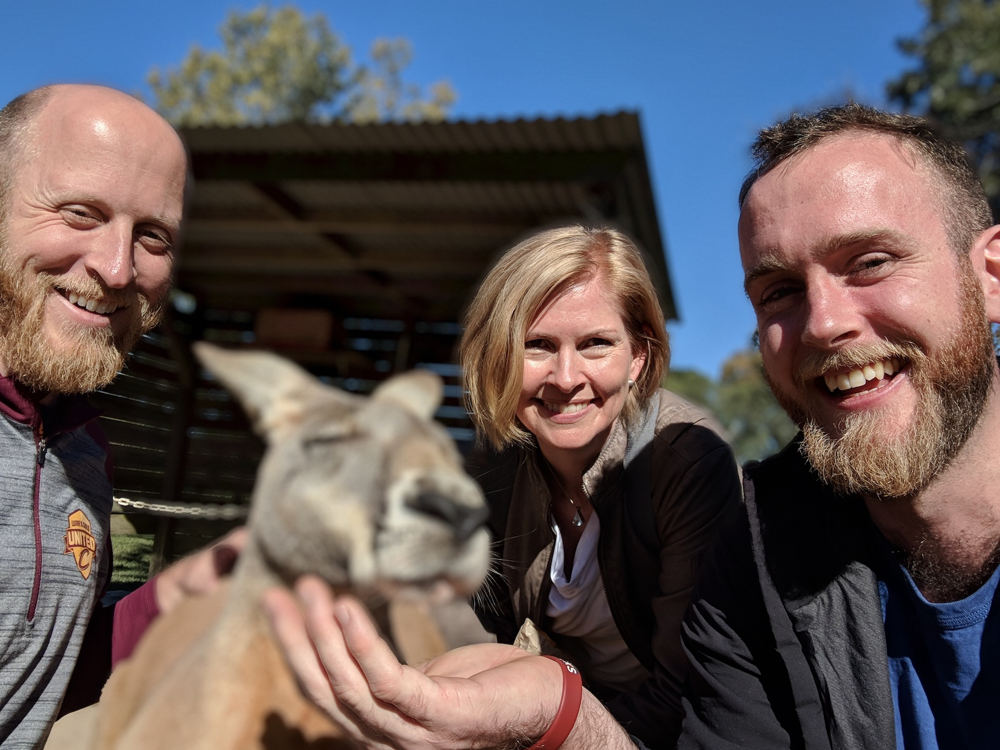

+++
# A Demo section created with the Blank widget.
# Any elements can be added in the body: https://sourcethemes.com/academic/docs/writing-markdown-latex/
# Add more sections by duplicating this file and customizing to your requirements.

widget = "blank"  # See https://sourcethemes.com/academic/docs/page-builder/
headless = true  # This file represents a page section.
active = true # Activate this widget? true/false
weight = 20  # Order that this section will appear.

title = ""
subtitle = ""

[design]
  # Choose how many columns the section has. Valid values: 1 or 2.
  columns = "1"

[design.background]
  # Apply a background color, gradient, or image.
  #   Uncomment (by removing `#`) an option to apply it.
  #   Choose a light or dark text color by setting `text_color_light`.
  #   Any HTML color name or Hex value is valid.

  # Background color.
  # color = "navy"
  
  # Background gradient.
  # gradient_start = "DeepSkyBlue"
  # gradient_end = "SkyBlue"
  
  # Background image.
  image = ""  # Name of image in `static/img/`.
  image_darken = 0.0  # Darken the image? Range 0-1 where 0 is transparent and 1 is opaque.

  # Text color (true=light or false=dark).
  text_color_light = false

[design.spacing]
  # Customize the section spacing. Order is top, right, bottom, left.
  padding = ["20px", "0", "20px", "0"]

[advanced]
 # Custom CSS. 
 css_style = ""
 
 # CSS class.
 css_class = "mini"
+++

I have lived in northeast Ohio for over 25 years and have long had an interest
in computers and programming, starting with writing programs in BASIC on our
family's IBM PS/1. I have also long had an interest in biology, particularly
genetics. Combining my two interests led me to pursue Bioinformatics, where I
worked at the Cleveland Clinic.

My [research at CCF](http://orcid.org/0000-0002-2739-7082) focused
on using high-throughput sequencing to study a variety of issues, such as
maternal obesity in mice, microbial populations in the Cuyahoga river, and
Plasmodium Vivax malaria.

Since joining RStudio I have given a number of [talks](TODO) about R and R
packages, which has allowed my to travel to Europe and Australia, as well as
throughout the United States.

While at the Cleveland Clinic, I became an avid user of the statistical
programming language R, using it to process, visualize, model and report our
data. I also began writing R packages and contributing to open source packages
on GitHub. I enjoyed working with open source software and being part of the R
community, so looked for opportunities that allowed me to continue to do so,
which eventually landed me at RStudio. You can follow my current work [on GitHub]
(https://github.com/jimhester).

In my free time, I love spending time with my family, my two daughters and my
dog.
