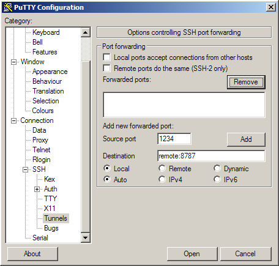

Our Rstudio server instance runs on a server which is not directly connected to the internet at large.  We can connect to it through a ssh tunnel to an intermediate server.  This works fine for the command line, but to access the Rstudio instance we need to be able to connect using our browser.  This can be accomplished easily on linux/OSX by the following ssh command.

Assume the tunnel server is tunnel, remote is remote, rstudio port is 8787

```{r eval = F, engine = 'bash'}
ssh -f -N -L 1234:remote:8787 tunnel
```

The equivalent putty settings are in the following screenshot, assuming you are connecting to the tunnel server through putty



You can then connect to your rstudio session from http://localhost:1234
